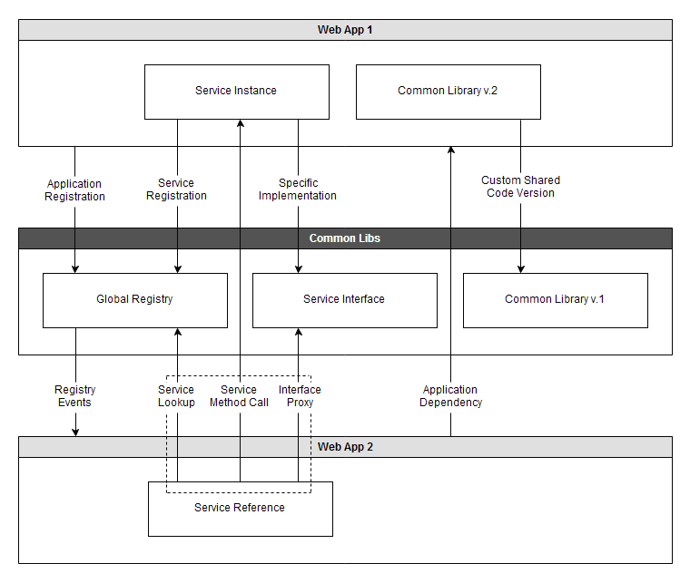

# VMware has ended active development of this project, this repository will no longer be updated.

# Ward

Ward is a simple library that enables runtime modularity for web applications
running in standard Servlet containers. It's built on top of the Spring
Framework and offers a lightweight alternative for scenarios that otherwise
require an OSGi container.

## Quickstart

Download and examine the structure of the provided sample. Choose one of the
following:

* Build the complete project and launch the sample application using the startup
script located in assembly/target/base-instance/bin

* Import the sample project in your IDE and use the built-in tooling to deploy
them in an Apache Tomcat instance with a customized catalina.properties
configuration containing a common.loader entry pointing to
<your-local-path>/samples/intro/assembly/target/base-instance/lib/*.jar

Use a browser to open http://localhost:8080/ward and examine how the application
behaves when WAR files are added or removed

## Architecture Diagram

## TODO

* Consider renaming classes from Application* to Module*
* Introduce application groups
* Implement a concurrent registry map
* Integration with the Live Beans view
* Enable nested ward:service beans

## License

Ward is released under the [Apache 2.0 License](LICENSE).
